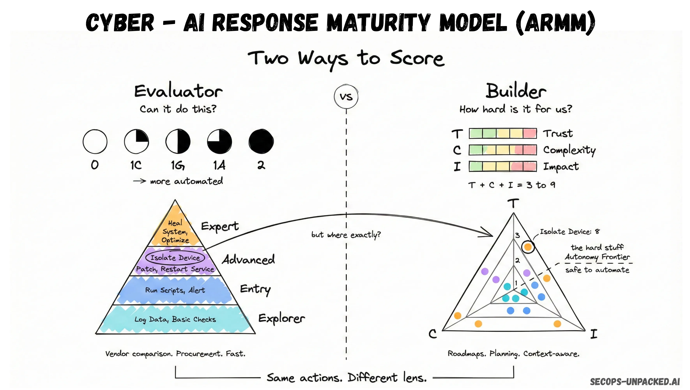

# ARMM Toolkit

A practical Python toolkit for scoring and comparing AI SOC solutions using the **AI Response Maturity Model (ARMM)**.

---

## Credits

**Toolkit implementation by:**

| Author | GitHub |
|--------|--------|
| Diego Andrade | [@ID1D](https://github.com/ID1D) |

**ARMM framework created by:**

| Author | Profile |
|--------|---------|
| Andrei Cotaie | SecOps Unpacked |
| Cristian Miron | SecOps Unpacked |
| Filip Stojkovski | SecOps Unpacked |

**Original framework:** [We built a framework to score AI SOC response capabilities](https://www.cybersec-automation.com/p/ai-response-maturity-model) — *SecOps Unpacked / CyberSec Automation Blog*, February 19, 2026.

**Official ARMM app:** [armm.secops-unpacked.ai](https://armm.secops-unpacked.ai)

This repository implements the ARMM framework as a practical open-source toolkit. All scoring methodology, capability domains, maturity tiers, and conceptual framework belong to the original authors. This toolkit exists to make their work accessible programmatically.

---

## What is ARMM?



ARMM is a structured scoring system for evaluating what an AI SOC solution can actually do in the **response layer** — not just analysis or alerting, but the ability to take action.

> *"SOAR gave us arms without brains. The first wave of AI SOC products gave us brains without arms. The products that will win this market are the ones that connect both. ARMM gives you a way to measure how far along that connection is."*
> — Andrei Cotaie, Cristian Miron & Filip Stojkovski

### The Two Problems ARMM Solves

1. **Marketing language is useless.** "AI-powered response" covers everything from fully autonomous isolation workflows to chatbots that suggest you reset a password. Both get the same label.
2. **No shared evaluation methodology.** Without a common framework, security teams have no standardized way to compare what products actually do.

### What ARMM Covers

**80+ response capabilities across 6 domains:**

| Domain | Actions | Description |
|--------|---------|-------------|
| Identity | 11 | User accounts, sessions, permissions, service principals |
| Network | 13 | ACLs, VLANs, firewall rules, quarantine, traffic control |
| Endpoint | 23 | File operations, process management, forensics, OS-level |
| Cloud | 15 | Infrastructure, storage, access controls, KeyVault |
| SaaS | 10 | Email, calendar, HR platform, inbox rules |
| General | 22 | Platform quality, AI-specific features, observability |

---

## Scoring Methodology

### Evaluator Mode — Side-by-side product comparison

images/Evaluator.webp

Score each capability on a 5-level scale:

| Score | Label | Meaning |
|-------|-------|---------|
| `0` | Not Available | Feature does not exist |
| `1C` | Collaborator | Continuous back-and-forth with analyst required |
| `1G` | Guide | Presents options, analyst chooses |
| `1A` | Approver | Action ready, needs one human click to execute |
| `2` | Fully Automated | Executes without human involvement |

**Key metrics:**
- **Coverage Rate** — % of capabilities available at any level above 0
- **Full Automation Rate** — % of capabilities at level 2 (the real signal)

> A product with 80% coverage but 5% automation is fundamentally different from one with 60% coverage and 40% automation. The first is a guided workflow tool with AI branding. The second operates with real autonomy where it counts.

### Builder Mode — Environment-aware implementation roadmap

Score each capability across three axes (each 1–3):

| Axis | Label | 1 | 2 | 3 |
|------|-------|---|---|---|
| **T** | Trust / Decision Fidelity | Enrichment only | Validated (human confirms) | Autonomous |
| **C** | Complexity | Simple API call | Multi-step orchestration | Custom/complex integration |
| **I** | Impact / Blast Radius | Low (tagging) | Medium disruption | High / production-critical |

**Action Score:** `S = T + C + I` (range: 3–9)

### Maturity Tiers

| Score Range | Tier | Description |
|-------------|------|-------------|
| 3.00 – 5.99 | **Explorer** | Foundational; low-risk quick wins |
| 6.00 – 6.99 | **Entry** | Stabilized; moderate effort and impact |
| 7.00 – 7.99 | **Advanced** | Mature; high-fidelity reasoning required |
| 8.00 – 9.00 | **Expert** | Critical; VIP handling, production-critical actions |

### Composite Label (Sequential Gating)

The composite label is the highest tier where **at least 4 out of 6 planes** independently meet that tier's threshold, with an unbroken chain from Explorer upward. A product cannot be labeled Advanced if it has gaps at the Explorer tier.

---

## Quick Start

### Installation

```bash
git clone https://github.com/ID1D/armm-toolkit.git
cd armm-toolkit
pip install -r requirements.txt
```

No external dependencies — pure Python 3.8+.

### CLI Usage

**Evaluator Mode (score a product):**
```bash
# Copy the template and fill in your scores
cp templates/evaluator_template.json my_product.json
# Edit my_product.json — change "0" to your scores: 0, 1C, 1G, 1A, or 2

python -m armm.cli evaluator --input my_product.json
```

**Builder Mode (environment-aware scoring):**
```bash
cp templates/builder_template.json my_env.json
# Edit my_env.json — adjust T, C, I values for your context

python -m armm.cli builder --input my_env.json
```

**Compare multiple products:**
```bash
python -m armm.cli compare --inputs product_a.json product_b.json product_c.json
```

**Save results as JSON:**
```bash
python -m armm.cli evaluator --input my_product.json --output report.json
```

### Python API

```python
from armm.scorer import EvaluatorAction, EvaluatorDomain, EvaluatorEvaluation

ev = EvaluatorEvaluation(name="My Product")

ev.add_domain(EvaluatorDomain("identity", "Identity Response Plane", actions=[
    EvaluatorAction("reset_password_std", "Reset Password", "1A"),
    EvaluatorAction("revoke_sessions",    "Revoke Sessions", "2"),
    EvaluatorAction("disable_user",       "Disable User",    "1A"),
    # ... more actions
]))

report = ev.report()
print(f"Composite Tier: {report['composite_tier']}")
print(f"Coverage: {report['overall_coverage_pct']}%")
print(f"Full Automation: {report['overall_automation_pct']}%")
```

```python
from armm.scorer import BuilderAction, BuilderDomain, BuilderEvaluation

ev = BuilderEvaluation(name="My Team's Context")
ev.add_domain(BuilderDomain("identity", "Identity Response Plane", actions=[
    BuilderAction("reset_password_std", "Reset Password", T=3, C=1, I=2),
    BuilderAction("revoke_sessions",    "Revoke Sessions", T=3, C=1, I=1),
    # ...
]))
print(ev.report())
```

---

## Examples

### Run the examples

```bash
# Evaluator Mode: compare two hypothetical products
python examples/evaluator_example.py

# Builder Mode: same product scored by three different organizations
python examples/builder_example.py
```

### Evaluator example output

```
  BrainBox AI
  Composite : 🟡 Entry
  Score     : 58.4%  Coverage: 76.2%  Automation: 14.3%

  AutoSOC Pro
  Composite : 🟠 Advanced
  Score     : 71.1%  Coverage: 91.4%  Automation: 38.1%
```

### Builder example output (same product, different orgs)

```
  Org A - Mature Program        → 6.45  🟡 Entry
  Org B - New Program           → 7.36  🟠 Advanced
  Org C - High-Risk Environment → 7.09  🟠 Advanced
```

The product capability is identical. The score reflects organizational reality.

---

## Repository Structure

```
armm-toolkit/
├── armm/
│   ├── __init__.py
│   ├── capabilities.json     # All 80+ capabilities with reference scores
│   ├── scorer.py             # Scoring engine (Evaluator + Builder)
│   └── cli.py                # Command-line interface
├── templates/
│   ├── evaluator_template.json   # Ready-to-fill Evaluator Mode template
│   └── builder_template.json     # Ready-to-fill Builder Mode template
├── examples/
│   ├── evaluator_example.py      # Hypothetical product comparison
│   └── builder_example.py        # Context-aware scoring demo
├── CONTEXT.md                    # Project context for AI assistants
├── requirements.txt
└── README.md
```

---

## Why This Matters

The AI SOC market has a signal problem. When every vendor claims "AI-powered response," that phrase covers:
- A fully autonomous device isolation workflow that runs without human approval
- A chatbot that summarizes an alert and suggests you maybe reset a password

ARMM forces the question: **at what level, across how many actions, and with what degree of autonomy?**

The Full Automation Rate is the real signal. High coverage with low automation means the product is a guided workflow tool. The ARMM framework, and this toolkit, exist to make that distinction measurable.

---

## License

MIT — free to use, modify, and distribute.

The ARMM framework itself was created by Andrei Cotaie, Cristian Miron, and Filip Stojkovski. Please credit them when using or sharing this work.
